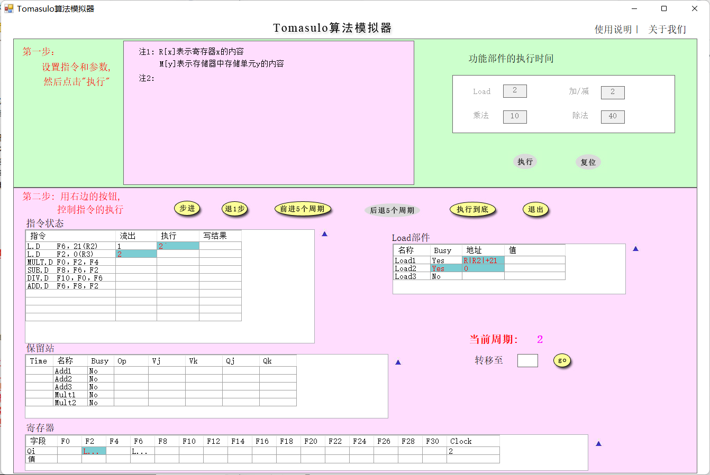
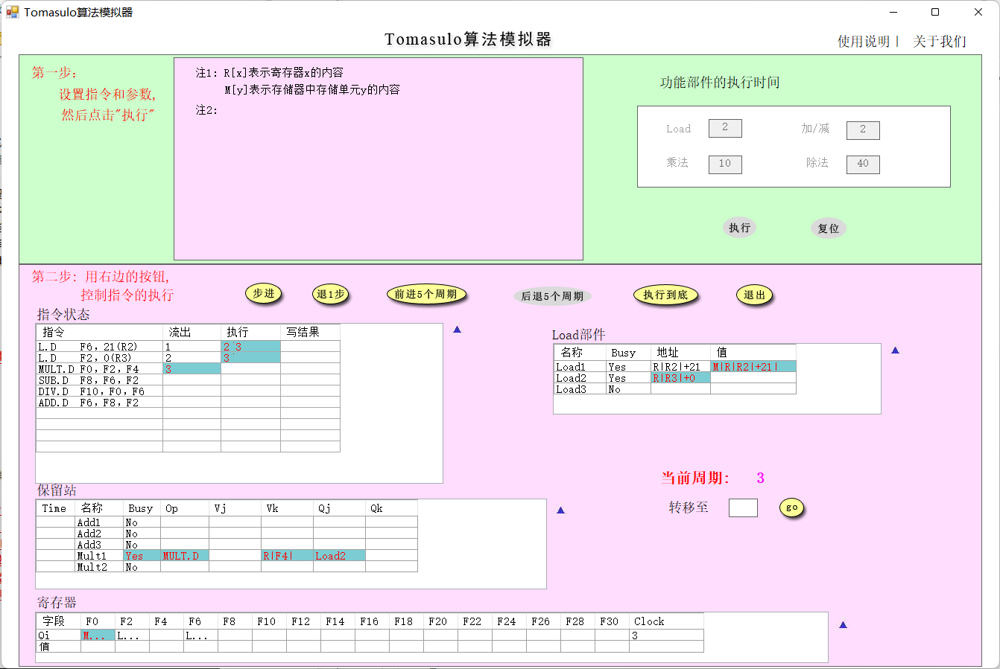
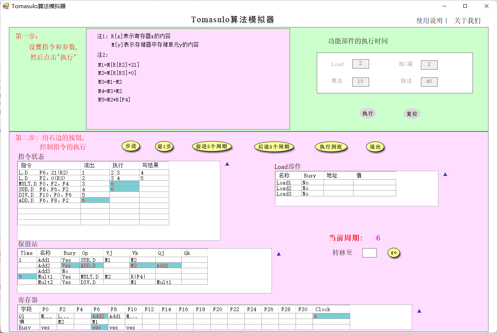
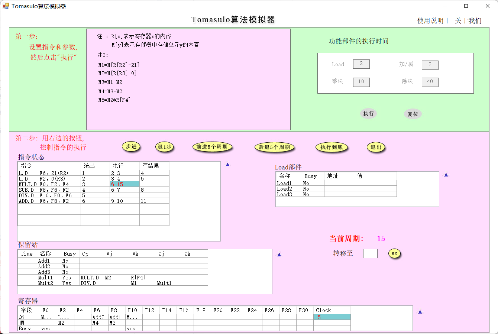
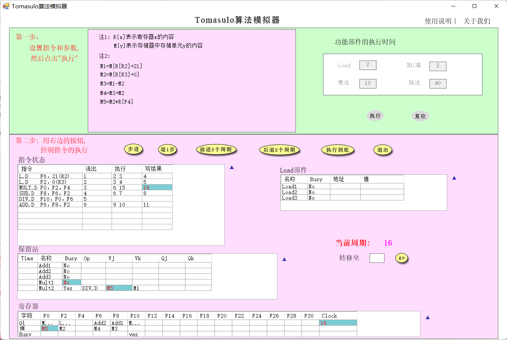
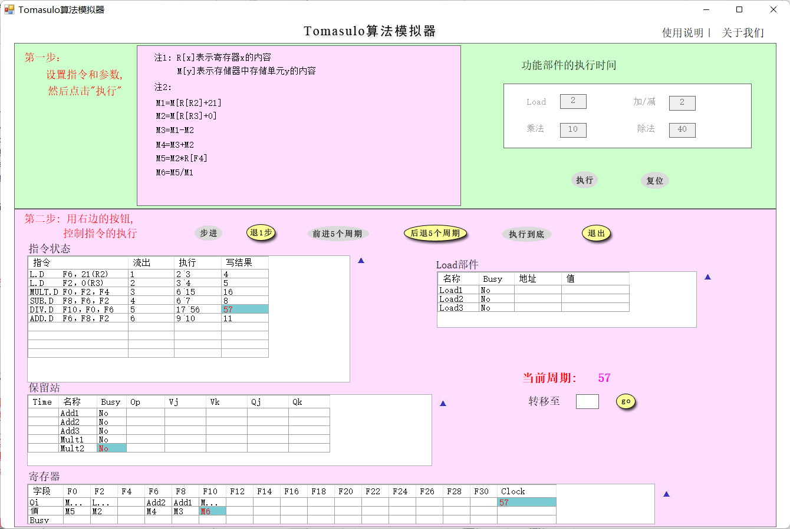
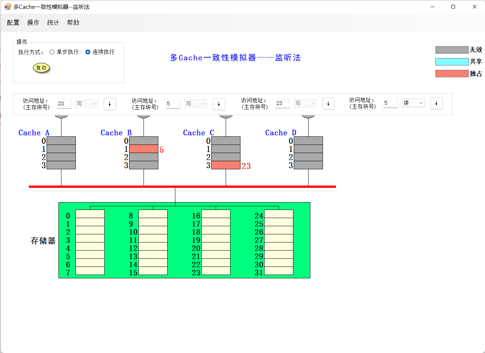
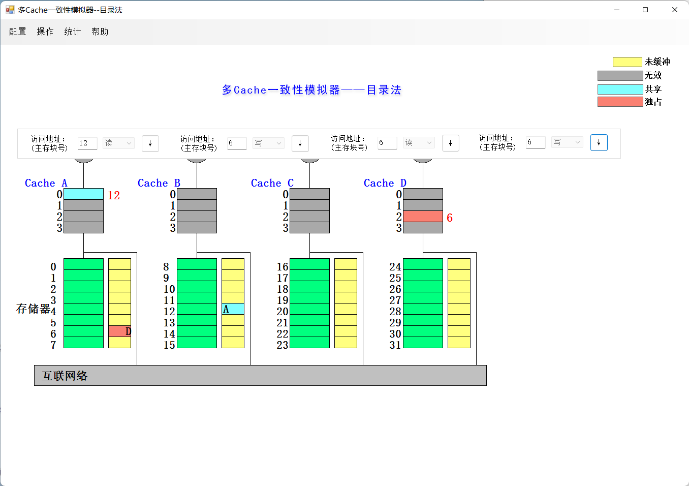

# 计算机体系结构-实验5

***

梁峻滔 PB19051175

***

[toc]

## 一. Tomasulo算法模拟器

### 1

周期2

周期3

Load部件的改动:

* Load1从memory中取出了值
* Load2的地址域从立即数0变成了有效地址(R3+0)

### 2

`MUL.D`从周期6开始执行

相比上一个周期所发生的改动:

* 指令状态:
    *  `L.D F2, 0(F3)`写结果结束.
    *  `MUL.D`和`SUB.D`同时进入执行状态, `ADD.D`流出.
* 保留站: 
    * Add2中添加了`ADD.D`指令, Vk域置为M2(已经获得, 即F2), Qj域置为Add1, 因为所需要的另一个操作数F8需要等待`SUB.D`执行完. 
    * 将Mult1的Time域置为9, 表示还需要9个周期才能完成计算.
* 寄存器: F6的状态变成Busy, 原因是新流出的`ADD.D`指令写F6.
* Load部件: 无变化.

### 3

`MUL.D`流出后没有立即执行是因为其所需要的一个操作数F2还没有加载出来, 即与`L.D F2 0(F3)`之间的**RAW**相关.

### 4

周期15

周期16

系统发生的变化:

* 指令状态: `MUL.D`指令执行阶段结束, 开始写结果.
* 保留站: 
    * Mult1变成No Busy.
    * Mult2的第一个操作数(即F0)变成可用, Qj域置0, Vj置成M5.
* 寄存器: F0从Busy变成No Busy, 其值变成M5.
* Load部件: 无变化.

### 5

在第57个周期结束, `DIV.D`是执行的最后一条指令, 在第57个周期开始写结果.

## 二. 多cache一致性算法-监听法

以下 I 表示无效, S表示共享, E表示独占. 模拟器采用**不优化**设置.

| 所进行的访问   | 是否发生了替换 | 是否发生了写回 | 监听协议进行的操作与块状态改变                               |
| -------------- | -------------- | -------------- | ------------------------------------------------------------ |
| CPU A 读第5块  | 否             | 否             | CPU A读缺失, Cache A发出BusRd信号, 存储器第5块经Bus传送到Cache A第1块, Cache A第1块状态从I变成S |
| CPU B 读第5块  | 否             | 否             | CPU B读缺失, Cache B发出BusRd信号, 存储器第5块经Bus传送到Cache B第1块, Cache B第1块状态从I变成S |
| CPU C 读第5块  | 否             | 否             | CPU C读缺失, Cache C发出BusRd信号, 存储器第5块经Bus传送到Cache C第1块, Cache C第1块状态从I变成S |
| CPU B 写第5块  | 否             | 否             | CPU B写命中, Cache B向Bus发出写作废信号, Cache A第1块和Cache C第1块状态都从S变成I, Cache B第1块状态从S变成E |
| CPU D 读第5块  | 否             | 是             | CPU D读缺失, Cache D发出BusRd信号, Cache B监听到后把它的第1块写回到存储器第5块, 然后状态从E变成S. 之后该块又从存储器传送到Cache D第1块, 状态设为S |
| CPU B 写第21块 | 是             | 否             | CPU B写缺失, Cache B发出BusRdx信号, 存储器第21块经Bus传送到Cache B第1块, 将原本的第1块替换出去, 状态设为E |
| CPU A 写第23块 | 否             | 否             | CPU A读缺失, Cache A发出BusRdx信号, 存储器第23块经Bus传送到Cache A第3块, 状态设为E |
| CPU C 写第23块 | 否             | 是             | CPU C写缺失, Cache C发出BusRdx信号, Cache A监听到该信号, 将其第3块写回到存储器第23块, 同时Cache A中该块状态改为I. 之后存储器第23块传送到Cache C第3块, 状态设为E |
| CPU B 读第29块 | 是             | 否             | CPU B读缺失, Cache B发出BusRd信号, 存储器第29块经Bus传送到Cache B第1块, 将原来的块替换出去, 将状态设为S |
| CPU B 写第5块  | 是             | 否             | CPU B写缺失, Cache B发出BusRdx信号, Cache D监听到该信号后将其第1块作废, 存储器第5块传送到Cache B第1块, 替换原来的块, 状态设为E |

最后整个cache系统的状态为

## 三. 多cache一致性算法-目录法

| 所进行的访问     | 目录协议进行的操作与块状态的改变                             |
| ---------------- | ------------------------------------------------------------ |
| CPU A 读第 6 块  | Cache A读缺失, 从本地存储器中传送第6块到Cache A第2块, Cache A该块状态设为S, 存储器中第6块状态也设为S, 将对应A的presence bit置1 |
| CPU B 读第 6 块  | Cache B读缺失, 通过互联网络从宿主存储器中传送第6块到Cache B第2块, Cache B该块状态设为S, 存储器中将对应B的presence bit置1 |
| CPU D 读第 6 块  | Cache D读缺失, 通过互联网络从宿主存储器中传送第6块到Cache D第2块, Cache D该块状态设为S, 存储器中将对应D的presence bit置1 |
| CPU B 写第 6 块  | Cache B写命中, 向宿主存储器发送写命中信号, 宿主存储器向A, D发送作废信号, 将第6块的A, D对应的presence bit复位, 将块状态设为E. Cache B写第2块, 将块状态设为E |
| CPU C 读第 6 块  | Cache C读缺失, 向宿主存储器发送读缺失信号, 宿主存储器向Cache B发送Fetch信号, Cache B将其第2块状态设为S, 向宿主存储器写回该块. 宿主存储器收到该块后将状态设为S, 将C对应的presence bit置1, 将该块传送给Cache C, Cache C将该块状态设为S |
| CPU D 写第 20 块 | Cache D写缺失, 通过互联网络从宿主存储器中传送第6块到Cache D第2块, Cache D该块状态设为E, 存储器中将对应D的presence bit置1, 块状态设为E |
| CPUA 写第 20 块  | Cache A写缺失, 向宿主存储器中发送Write miss,  宿主存储器向Cache D发送Fectch信号, Cache D将其第0块写回宿主存储器, 将块状态设为I. 存储器中将对应D的presence bit复位, 将A对应的presence bit置1, 块状态设为E, 将该块传送给Cache A. Cache A中该块状态设为E |
| CPU D 写第 6 块  | Cache D写缺失, 向宿主存储器发送Write miss,  宿主存储器向Cache D传送该块, 将对应B, C的presence bit复位, 将D对应的presence bit置1, 块状态设为E, 向Cache B, C发出作废信号. Cache D中该块状态设为E. Cache B, C均将该块状态设为I |
| CPU A 读第 12 块 | Cache A读缺失, 第12块要替换出Cache A中的第0块, 先将原本的第0块写回到宿主存储器第20块, 存储器中第20块状态变成未缓冲. 宿主存储器将第12块的状态设为S, 将A对应的presence bit置1, 将该块传送给Cache A. , 然后换入, 块状态设为S |

最后整个cache系统状态为:

## 四. 综合问答

### 1. 目录法和监听法分别是集中式和基于总线，两者优劣是什么？

#### 监听法

* 优点

    核数较少时，总线压力较小，成本低，效果好.

* 缺点

    需要通过总线广播一致性相关信息. 总线上能够连接的处理器数目有限. 当核数增多时，总线冲突增加, 监听带宽成为瓶颈.

#### 目录法

* 优点

    使用集中目录来记录每个cache块的状态，不需要总线广播一致性信息, 总线压力小.

* 缺点

    需要维护目录数据结构, 随着核数增加时目录的开销变大.

### 2. Tomasulo 算法相比 Score Board 算法有什么异同？

* 两者都解决了三种相关，两种算法都是通过动态调度的方式来解决RAW冲突.
* 在解决WAR和WAW时，Tomasulo使用Renaming的技术，Score Board使用插入Stall的技术.
* Tomasulo是分布式，Score Board是集中式.

### 3. Tomasulo 算法是如何解决结构、RAW、WAR 和 WAW 相关的？

* RAW：Tomasulo跟踪每个源操作数当前是否可用，仅当所有源操作数可用时才~~发射指令~~允许指令进入执行阶段.
* WAR，WAW：Tomasulo使用硬件寄存器重命名技术解决WAR和WAW.